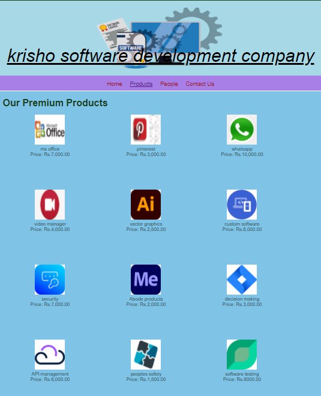

# Web Design for a Software Product Company

## AIM:

To design a static website for a software product company company.

## DESIGN STEPS:

### Step 1:

Requirement collection.

### Step 2:

Creating the layout using HTML and CSS.

### Step 3:

Updating the sample content.

### Step 4:

Choose the appropriate style and color scheme.

### Step 5:

Validate the layout in various browsers.

### Step 6:

Validate the HTML code.

### Step 6:

Publish the website in the given URL.

## PROGRAM :
```
### Home page coding:
<!DOCTYPE html>
<html lang="en">
  <head>
    <title>Fashion Gallery</title>
    <link rel="stylesheet" href="./css/layout.css" />
    <link rel="icon" href="./img/icon.png" type="image/x-icon" />
  </head>

  <body>
    <div class="container">
      <div class="banner">Fashion Gallery.</div>
      <div class="menu">
        <div class="menuitemselected"><a href="/static/home.html">Home</a></div>
        <div class="menuitem"><a href="/static/products.html">Products</a></div>
        <div class="menuitem"><a href="/static/people.html">People</a></div>
        <div class="menuitem"><a href="/static/contact.html">Contact Us</a></div>
      </div>
      <div class="content">
        <div class="homecontent">
          <h1>About Us</h1>
          
          <div class="contenttext">
         World of Fashion!
            At Brand Factory, online clothes shopping is a breeze, thanks to our treasure-trove of designer selections from all the top fashion houses.
            We are one of a kind online shopping website with accessible fashion for all. We bring to you: 
            1. Stylish Men and women Fashion: If you are on the hunt for stylish yet affordable men and women fashion, we have everything you need under a single roof! From office formal wear to weekend casual wear, we have you covered
           <br />
              World of Fashion! online shop where you will find an amalgamation of western fashion forward styles, impeccable quality and great value.
           Together, these factors make your online shopping experience with ONLY truly unique.
           Each style is created with a special ONLY feeling, which resonates with the self-confidence, style and a carefree attitude of the style conscious young woman.
            <ul>
              <li>Find what you are Looking for in 1 Minute or Less! Unlimited Access</li>
              <li>Insightful , actionable & customizable reports</li>
              <li>Anywhere, anytime and secure access</li>
            </ul>
          </div>
        </div>
      </div>
      <div class="footer">
        Copyright &#169;  2045  World of Fashion!developed by Pavithra R
      </div>
    </div>
  </body>
</html>

### Product page coding:
<!DOCTYPE html>
<html lang="en">
  <head>
    <title> World of Fashion!</title>
    <link rel="stylesheet" href="./css/layout.css" />
    <link rel="icon" href="./img/icon.png" type="image/x-icon" />
  </head>

  <body>
    <div class="container">
      <div class="banner"> World of Fashion!.</div>
      <div class="menu">
        <div class="menuitem"><a href="/static/home.html">Home</a></div>
        <div class="menuitemselected"><a href="/static/products.html">Products</a></div>
        <div class="menuitem"><a href="/static/people.html">People</a></div>
        <div class="menuitem"><a href="/static/contact.html">Contact Us</a></div>
      </div>
      <div class="content">
        <div class="productcontent">    
          <h1>Our Premium Products</h1>
          <div class="productitems">
              <div class="productitem"> 
                  <div class="itemimage">
                  
                  </div>
                  <div class="itemname">long maxi</div>
                  <div class="itemprice">Price: Rs.3,000.00 </div>
              </div>
              <div class="productitem"> 
                  <div class="itemimage">
                  
                  </div>
                  <div class="itemname">white shirt</div>
                  <div class="itemprice">Price: Rs.1,000.00 </div>
              </div>
              <div class="productitem"> 
                <div class="itemimage">
                
                </div>
                <div class="itemname">Coat suit</div>
                <div class="itemprice">Price: Rs.5,000.00 </div>
              </div>
              <div class="productitem"> 
                <div class="itemimage">
                
                </div>
                <div class="itemname">Red maxi</div>
                <div class="itemprice">Price: Rs.4,000.00 </div>
              </div>
              <div class="productitem"> 
                <div class="itemimage">
                
                </div>
                <div class="itemname">Grey frock</div>
                <div class="itemprice">Price: Rs.2,500.00 </div>
              </div>
              <div class="productitem"> 
                <div class="itemimage">
                
                </div>
                <div class="itemname">Blue suit</div>
                <div class="itemprice">Price: Rs.6,000.00 </div>
              </div>
              <div class="productitem"> 
                <div class="itemimage">
                
                </div>
                <div class="itemname">legenga</div>
                <div class="itemprice">Price: Rs.7,000.00 </div>
              </div>
              <div class="productitem"> 
                <div class="itemimage">
                
                </div>
                <div class="itemname">short top/skirt</div>
                <div class="itemprice">Price: Rs.2,000.00 </div>
              </div>
              <div class="productitem"> 
                <div class="itemimage">
                
                </div>
                <div class="itemname">Kids suit</div>
                <div class="itemprice">Price: Rs.3,000.00 </div>
              </div>
              <div class="productitem"> 
                <div class="itemimage">
                
                </div>
                <div class="itemname">fancy legenga</div>
                <div class="itemprice">Price: Rs.6,000.00 </div>
              </div>
              <div class="productitem"> 
                <div class="itemimage">
                
                </div>
                <div class="itemname">Tops(combo)</div>
                <div class="itemprice">Price: Rs.1,500.00 </div>
              </div>
              <div class="productitem"> 
                <div class="itemimage">
                
                </div>
                <div class="itemname">crop top</div>
                <div class="itemprice">Price: Rs.800.00 </div>
              </div>
          </div>
          </div>        
      </div>
      <div class="footer">
        Copyright &#169; 2045   World of Fashion! developed by Pavithra R
      </div>
    </div>
  </body>
</html>

### Contact page coding:
<!DOCTYPE html>
<html lang="en">
  <head>
    <title> World of Fashion!</title>
    <link rel="stylesheet" href="./css/layout.css" />
    <link rel="icon" href="./img/globee.png" type="image/x-icon" />
  </head>
  
  <body>
    <div class="container">
      <div class="banner"> World of Fashion!.</div>
      <div class="menu">
        <div class="menuitem"><a href="/static/home.html">Home</a></div>
        <div class="menuitem"><a href="/static/products.html">Products</a></div>  
        <div class="menuitem"><a href="/static/people.html">People</a></div>
        <div class="menuitemselected"><a href="/static/contact.html">Contact Us</a></div>
      </div>
      
        <div class="contact content">
           <h1>Our Contact Address</h1>  
        
          <div class="contacttext">
           Address: 31, gandhi nagar, adyar, Chennai - 6000105
           <br>Phone:7852347509
           <br>Email-address:Onlineproductssale@gmail.com
          </div>
        </div>

     
<div class="footer">
  Copyright &#169; 2045  World of Fashion! developed by Pavithra R
</div>
</div>
</body>
</html>

### People page coding:
<!DOCTYPE html>
<html lang="en">
  <head>
    <title>RJsoftware Private Limited</title>
    <link rel="stylesheet" href="./css/layout.css" />
    <link rel="icon" href="./img/globee.png" type="image/x-icon" />
  </head>

  <body>
    <div class="container">
      <div class="banner">RJsoftware Private Limited.</div>
      <div class="menu">
        <div class="menuitem"><a href="/static/home.html">Home</a></div>
        <div class="menuitem"><a href="/static/products.html">Products</a></div>  
        <div class="menuitemselected"><a href ="/static/people.html"></a>People</a></div>
        <div class="menuitem"><a href="/static/contact.html">Contact Us</a></div>
      </div>
      <div class="content">
      <div class="productitem"> 
        <div class="itemimage">
        
      </div>
         <div class="itemname">Navnit</div>
         <div class="itemname">Manager</div>
      </div>
      <div class="productitem"> 
        <div class="itemimage">
        
      </div>
         <div class="itemname">Joel</div>
         <div class="itemname">Cashier</div>
      </div>
      <div class="productitem"> 
        <div class="itemimage">
        
      </div>
        <div class="itemname">Angelin</div>
        <div class="itemname">Salesperson</div>
      </div>
      <div class="productitem"> 
        <div class="itemimage">
        
      </div>
        <div class="itemname">jeneshiya</div>
        <div class="itemname">Salesperson</div>
      </div>
      <div class="productitem"> 
        <div class="itemimage">
        
      </div>
        <div class="itemname">selena</div>
        <div class="itemname">Salesperson</div>
      </div>
      <div class="productitem"> 
        <div class="itemimage">
        
      </div>
        <div class="itemname">Satya pandit</div>
        <div class="itemname">Salesperson</div>
      </div>
      <div class="footer">
        Copyright &#169; 2045 RJsoftware Private Limited, Developed by Pavithra R
      </div>
    </div>
  </body>
</html>

### Layout:
* {
  box-sizing: border-box;
  font-family: Arial, Helvetica, sans-serif;
}
body {
  background-color: whitesmoke;
  color: #17421d;
}
.container {
  width: 1080px;
  margin-left: auto;
  margin-right: auto;
  border-width: 1px 1px 1px 1px;
  border-style: solid;
  box-shadow: 15px 15px 8px gray;
}

.banner {
  display: block;
  width: 100%;
  height: 250px;
  text-align: center;
  font-size: 60px;
  background-image: url("/static/img/banner3.jpg");
  background-size: 100% 100%;
  margin: 0px 0px 0px 0px;
  padding-top: 150px;
  color: black;
}

.menu {
  display: block;
  width: 100%;
  height: 50px;
  font-size: larger;
  background-color: #a77fe6;
  text-align: center;
  padding-top: 15px;
  margin: 0px 0px 0px 0px;
  border-width: 1px;
}

.menuitem {
  display: inline-block;
  margin-left: 10px;
  margin-right: 10px;
}
.menuitemselected {
  display: inline-block;
  margin-left: 10px;
  margin-right: 10px;
  color: #16d1ae;
}

.menuitem a {
  text-decoration: none;
  color: #9c1018;
}

.content {
  display: block;
  width: 100%;
  background-color: #7fc3e7;
  min-height: 500px;
  margin: 0px 0px 0px 0px;
  border-width: 1px;
  border-color: white;
  border-style: solid;
}
.homecontent {
  min-height: 500px;
  margin: 10px 10px 10px 10px;
}
.homecontent h1 {
  text-align: left;
}
.homecontent img {
  float: right;
  width: 400px;
  height: 300px;
  margin-left: 10px;
}

.contenttext {
  text-align: justify;
}

.productcontent {
  min-height: 500px;
  margin: 10px 10px 10px 10px;
}

.productcontent h1 {
  text-align: left;
}

.productitems {
  display: block;
}

.productitem {
  display: inline-block;
  width: 30%;
  height: 250px;
  text-align: center;
}

.productitem img {
  width: 100px;
  height: 100px;
  display: block;
}
.productitem .itemimage {
  display: block;
  margin-left: auto;
  margin-right: auto;
  width: 100px;
  margin-bottom: 5px;
}

.productitem .itemname {
  display: block;
}
.productitem .itemprice {
  display: block;
}

.footer {
  display: block;
  width: 100%;
  height: 40px;
  background-color: #a77fe6;
  text-align: center;
  padding-top: 10px;
  margin: 0px 0px 0px 0px;
  color: #9c1018;
}

```

## OUTPUT:

### Home Page:


### Product:



### People:


### Contact:


## Result:

Thus a website is designed for the software product company and the HTML,CSS code are validated.
